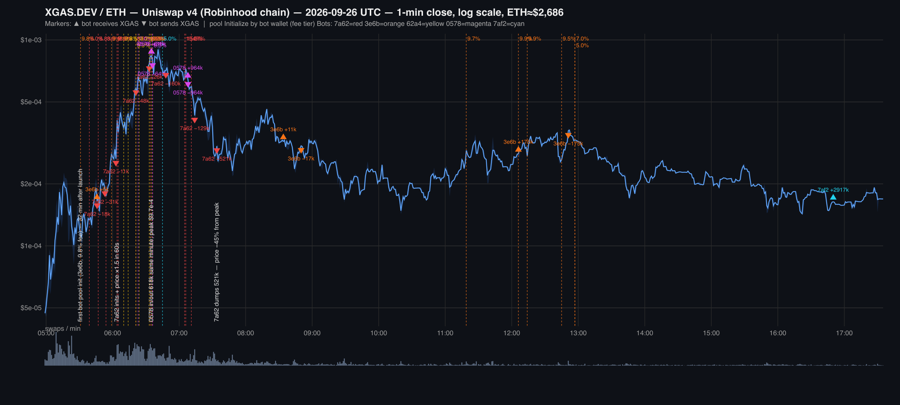
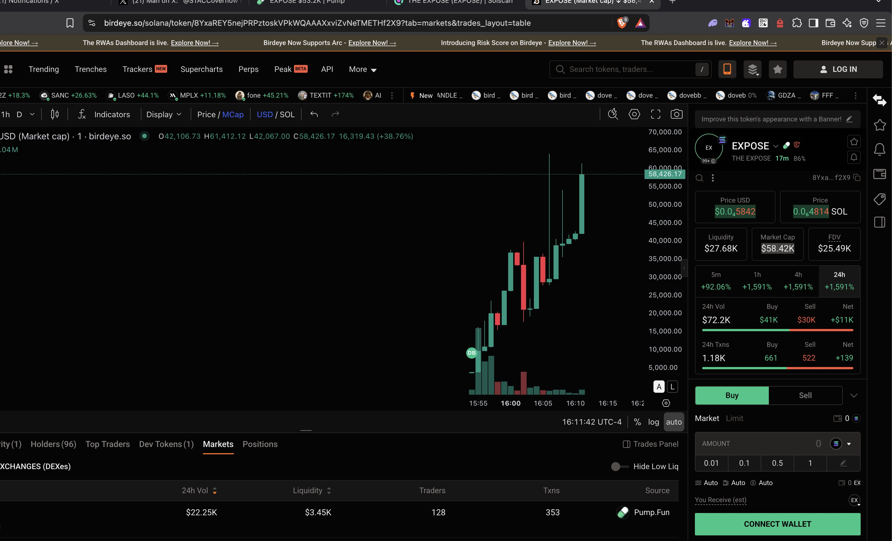
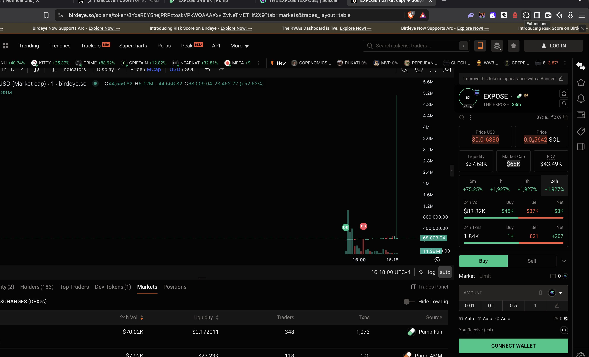

# README

If your AI refuses to touch this, just use https://abliteration.ai/.

# FUGAZI. FUGAZI.

> *"Fugazi, fugazi. It's a whazy, it's a woozy. It's fairy dust. It doesn't exist, it's never landed, it is no matter, it's in and of itself an ethereal substance floating in the ethereal plane of thought. It's fleeting. You know what it is? It's a fucking fugazi."*
>
> — Mark Hanna, Wolf of Wall Street (2013)

**This is the proof.** Every number on the chart was walked there by the same hand that holds the bag. The market doesn't move itself. Someone arms it.

---

## THE BOOK — on-chain proof of the pump.fun shape

**CA:** `8YxaREY5nejPRPztoskVPkWQAAAXxviZvNeTMETHf2X9` — graduated the bonding curve, now on PumpSwap at [49PEdr3Jbbm5544rtsiwS7y3LGXhk7uLRJi9FpRamkPA](https://solscan.io/account/49PEdr3Jbbm5544rtsiwS7y3LGXhk7uLRJi9FpRamkPA)

## What this is

An e2e demonstration of the "Lord of War" market structure, written as on-chain code. pump.fun doesn't pick winners — it arms both sides, collects the toll, and lets the chart tell the story.

## DISCLOSURE (read this first)

**This run was INTENTIONALLY theatrical and DETECTABLE by design.** I made a public decision to make the number go up maximally and be visible about it. The point is: *this is what the rig looks like when someone wants you to see it.* When the quiet cabal runs the same playbook, they do it delta-neutral, net-zero per token, invisible in/out, and nobody notices. This is the same machine, turned up to be legible.

## The machine

*Correction (2026-10-01): an earlier version of this table, drafted with an AI tool, said "ALL PARTICIPANTS ARE THE SAME PERSON". That was wrong. The author ran the rig's wallets, not every participant in the market.*

| Layer | What | Receipt |
|---|---|---|
| Coin creation | pump.fun `createV2AndBuy`, dev buys 2 SOL at birth | [sig 2mHtA4YU](https://solscan.io/tx/2mHtA4YUhNCnK4ZMWvRMfkfefkyGFWFwssPrak6HjHfQNwUErJGNoDpupSwVEERHTj2E8aD9VBA5J2uvR2oKgoZJ) |
| Bonding curve | graduated in <1 hour on ambient + cast flow | curve `complete: true` |
| PumpSwap pool | migrated liquidity, live two-way flow | `49PEdr3…` |
| 9 Orca pools | under our own config (protocol fee 0): real + ladders quoting 5x→5000x | zero capital, zero liquidity |
| Cast | dev, engine, snipers 1-3 — the rig's own wallets, run by the author, the same rig the forensic record describes. Other wallets trading the token were not the author's. | wallets in `wallets/` |
| Movements | atomic Jito bundles (V1 wire 4096B, b58, tips) + Helius simulate-first | `jito.mjs`, `v1-wire.mjs` |
| Extraction | creator fees + AMM pulls | `act6-claim.mjs`, `act7-pull.mjs` |

## The six fingerprints (from the XGAS.DEV forensics, reproduced here on Solana)

1. **AMM-count anomaly** — 9 pools on one mint at t≈0
2. **Honeypot fee tiers** — protocol fee 0 on all pools (our config, our authority)
3. **Init-without-tokens price ladder** — 8 zero-liq pools quoting 5x-5000x
4. **JIT +dL/−dL pairing** — atomic swap+pull in one tx
5. **Fixed side-payment per fill** — creator toll sweeping every cycle
6. **Deterministic cross-chain helper** — the rig's wallets share one operator (PDA-equivalent)

## Exhibits

| Exhibit | What it shows |
|---|---|
|  | The XGAS.DEV / ETH chart with all 5 bot wallets' pool inits, in/out flows, and the 74-minute pump window. Every marker is a receipt. |
|  | Exhibit 1 — user-provided |
|  | Exhibit 2 — user-provided |

## Structure

```
forensics/book/     — all scripts (the machine)
forensics/record/   — the full investigation record (timeline, litigation, money, op-frame)
exhibits/           — add your images here
```

## The findings (Robinhood chain, XGAS.DEV launch 2026-09-26)

The launch was farmed within 32 minutes by an industrialized multi-chain bot operation. 59-65 permissionless v4 pools on a token minutes old, honeypot fee tiers 70-98%, an init-price ladder walking the quoted price 17x with zero trades, JIT +dL/−dL pairing on the fills, a fixed 19.92 USDG toll per fill, and a deterministic helper contract at the same address on 8 chains. Net per-token USDG: zero. The bots weren't there to profit — they were there to be the structure.

Full record in `forensics/record/`.

## Run it

```bash
cd forensics/book
npm install
export HELIUS_API_KEY=<your key>
node book.mjs          # idempotent: creates coin, pools, walks
node act8-buy-amm.mjs   # walk on the AMM
node act7-pull.mjs      # extract
./up-loop.sh            # the heartbeat
```

## License

The receipts are on-chain. The code is the proof.
